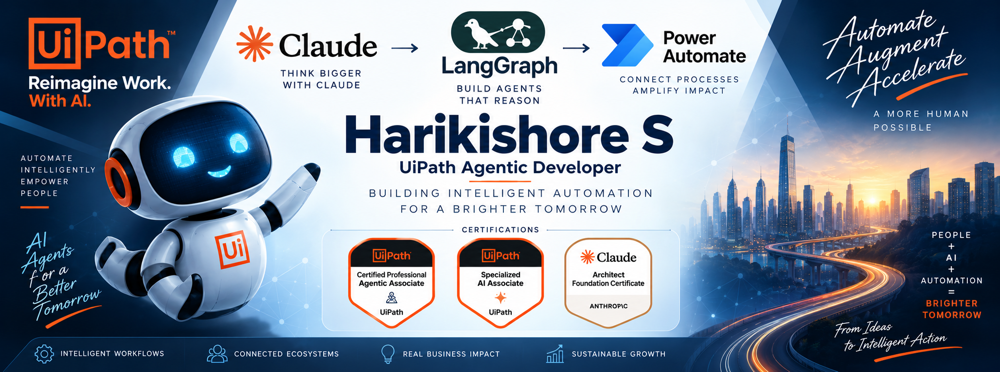

  

  <strong>🤖 Engineering the next generation of intelligent automation</strong>

  From deterministic RPA to AI-powered workflows and autonomous agents,
  I build automation solutions designed to work smarter, adapt faster,
  and scale across enterprise processes.

  

---

## 🚀 About Me

I specialize in building **intelligent automation solutions** that bring
together RPA, AI, LLMs and agentic technologies.

With **3+ years of experience in automation**, my work spans:

- 🤖 **UiPath RPA & Intelligent Automation**
- 🧠 **Agentic AI & AI Agent Development**
- 🔗 **UiPath Maestro & Maestro Flow**
- ✨ **Generative AI & Large Language Models**
- 🟣 **Claude, Claude Code & Claude Agent SDK**
- 📄 **Document Understanding & Intelligent Document Processing (IXP)**
- 🔌 **AI & REST API Integrations**
- 🧩 **RE Framework**
- 🐍 **Python Automation & Data Processing**

### 🔄 My Automation Journey

**RPA → Intelligent Automation → AI-Powered Automation → Agentic Automation**

I'm particularly interested in how **AI agents, LLMs, MCP, orchestration
and enterprise automation** can work together to solve complex business
problems.

---

## 🧠 Agentic AI & Generative AI

---

## 🔥 Emerging Agentic Technologies

---

## ⚙️ UiPath & Intelligent Automation

---

## 🔌 AI, Integration & Developer Tools

---

## 📊 Data & Analytics

---

## 🏆 Certifications

- 🏆 **UiPath Certified Professional – Agentic Associate**
- 🧠 **UiPath Specialized AI Associate**
- 🤖 **Claude Architect Foundation Certificate**

---

## 📈 Automation Impact

- 🚀 Delivered **5+ automation solutions** across business processes.
- ⚡ Achieved up to **70% reduction in manual effort** through automation.
- 🎯 Delivered automation with **99% error-free execution**.
- 🤖 Combined **RPA + AI** to build intelligent automation solutions.
- 🧠 Continuously exploring **Agentic AI, AI Agents and AI-native automation**.

---

## 🛠️ Featured Projects

### 🔹 [Leave Approval – Maestro Flow](https://github.com/harik25/Leave-approval-mastero-flow)

An intelligent leave approval workflow built around **UiPath Maestro Flow**,
demonstrating agentic orchestration and business process automation.

**Tech:** UiPath · Maestro Flow · Agentic Automation

---

### 🔹 [PromptLab](https://github.com/harik25/PromptLab)

A prompt engineering and experimentation project focused on developing,
testing and refining prompts for AI-powered workflows.

**Tech:** TypeScript · Generative AI · Prompt Engineering

---

### 🔹 [UiPath Expense Tracker App](https://github.com/harik25/ExpenseTrackerUipathApp)

Automated daily expense tracking and categorization using UiPath,
providing structured financial insights.

**Tech:** UiPath · App Studio · Automation

---

### 🔹 [YouTube Data Harvesting](https://github.com/harik25/YotubeDataHarvesting)

Extracts YouTube data using the YouTube API, processes the data with
Pandas, stores it in MySQL and provides interactive visualization.

**Tech:** Python · YouTube API · Pandas · MySQL · Streamlit

---

### 🔹 [Newsfeed Automation](https://github.com/harik25/Newsfeed)

Automated news collection and content aggregation using UiPath.

**Tech:** UiPath · Web Automation · Data Extraction

---

### 🔹 [Website Data Extraction](https://github.com/harik25/AECCwebsiteDataExtraction)

Automated website data extraction and structured data processing.

**Tech:** UiPath · Web Automation · Data Extraction

---

### 🔹 [Financial Data Extraction Automation](https://github.com/harik25/FinancialDataExtractionAutomation)

Automated financial document processing and data extraction.

**Tech:** UiPath · Document Understanding · GenAI · Excel Automation

---

## ✍️ Articles & Blogs

  

---

## 🤝 Let's Connect

---

  <b>Building intelligent automation today for a more human tomorrow. 🚀</b>

